# 🗄️ Blitar Mengaji — Rencana Database (DATABASE-PLAN)

> **Acuan tunggal** struktur database Blitar Mengaji.
> Dokumen ini diturunkan langsung dari `db/schema.ts` (sumber kebenaran utama),
> dilengkapi konvensi dari `docs/DATABASE-ARCHITECTURE.md` dan data awal dari `db/seed.ts`.
> Jika ada perbedaan antara dokumen ini dan `db/schema.ts`, **`db/schema.ts` yang menang** —
> ketidaksesuaian dicatat di [Bagian 13](#13-pertanyaan-terbuka--keputusan-db).

---

## Daftar Isi
1. [Ringkasan & Tujuan](#1-ringkasan--tujuan)
2. [Konvensi](#2-konvensi)
3. [Daftar Enum](#3-daftar-enum)
4. [Katalog Tabel](#4-katalog-tabel)
5. [Relasi (Relationships)](#5-relasi-relationships)
6. [Soft Delete & Restore](#6-soft-delete--restore)
7. [Storage Blob per-Entitas](#7-storage-blob-per-entitas)
8. [Pembayaran QRIS + WhatsApp](#8-pembayaran-qris--whatsapp)
9. [Indeks & Performa](#9-indeks--performa)
10. [ERD (Mermaid)](#10-erd-mermaid)
11. [Seed Awal](#11-seed-awal)
12. [Rencana Migrasi & Eksekusi](#12-rencana-migrasi--eksekusi)
13. [Pertanyaan Terbuka / Keputusan DB](#13-pertanyaan-terbuka--keputusan-db)

---

## 1. Ringkasan & Tujuan

Blitar Mengaji adalah platform dakwah/komunitas (Next.js) yang memetakan titik dakwah, kajian, jadwal, keuangan & donasi, konten komunitas (catatan/tanya ustadz/perpustakaan), kelas online & event, lapak usaha, serta asisten AI dengan pencarian semantik (RAG). Stack data memakai **Neon Postgres** sebagai database dan **Drizzle ORM** sebagai layer skema & query (`drizzle-orm/pg-core`, driver `@neondatabase/serverless`). Skema saat ini terdiri atas **49 tabel** dan **28 enum** (`pgEnum`), dengan konvensi soft delete/recycle bin, penyimpanan Blob per-entitas, pembayaran QRIS + konfirmasi WhatsApp, dan kolom embedding `vector(1024)` (pgvector) untuk AI. Dokumen ini menjadi acuan tunggal struktur DB bagi developer, agar penamaan tabel/kolom, relasi, indeks, dan langkah migrasi konsisten.

---

## 2. Konvensi

| Aspek | Aturan |
|---|---|
| **Primary key** | `id uuid` dengan default `gen_random_uuid()` (Drizzle `.primaryKey().defaultRandom()`). Pengecualian: `verification_tokens` (PK gabungan `identifier, token`), `settings` (PK `key`), dan tabel join (`role_permissions`, `user_roles`, `post_categories`, `post_tags`) yang memakai PK gabungan. |
| **Waktu** | `created_at timestamptz NOT NULL DEFAULT now()` dan `updated_at timestamptz NOT NULL DEFAULT now()` pada tabel entitas/konten. Semua kolom timestamp memakai `withTimezone: true` (**timestamptz**). `updated_at` di-update di service/app layer. |
| **Soft delete** | `deleted_at timestamptz NULL` (NULL = aktif) + `deleted_by uuid NULL` (logis → `users.id`). Disebar via helper `softDelete`. `deleted_by` **sengaja tanpa** `.references()` untuk menghindari siklus deklarasi (lihat [Bagian 6](#6-soft-delete--restore)). |
| **Penamaan** | Nama tabel & kolom database memakai **snake_case** (mis. `titik_dakwah`, `owner_user_id`). Properti TypeScript di Drizzle memakai camelCase (mis. `ownerUserId`) tetapi nama kolom DB tetap snake_case. **Katalog di bawah memakai nama kolom DB (snake_case).** |
| **Tipe uang** | `numeric(14,2)` (mis. `amount`, `target_amount`, `price`, `total_income`). Koordinat: `numeric(10,7)` (`latitude`/`longitude`). |
| **JSON** | `jsonb` untuk konfigurasi/metadata (mis. `content_rich`, `tokens_json`, `value_json`, `social_json`, `payload_json`, `meta_json`). |
| **Vektor AI** | `vector(1024)` (custom type pgvector) pada `content_embeddings.embedding`. Disimpan sebagai literal `[0.1,0.2,...]`. |
| **Bilangan besar** | `bigint` (mode number) untuk `storage_configs.bytes_used`. |
| **FK** | Kolom `*_id` dengan `references()`. Aksi `on delete` umum: `set null` untuk relasi opsional (mis. owner/penulis), `cascade` untuk anak yang terikat erat ke induk (mis. `kajian_schedules` → `kajian`, join tables). |
| **Extensions wajib** | `CREATE EXTENSION IF NOT EXISTS vector;` (pgvector untuk embedding) dan `CREATE EXTENSION IF NOT EXISTS pgcrypto;` (untuk `gen_random_uuid()` & dukungan enkripsi). |

---

## 3. Daftar Enum

Semua `pgEnum` dari `db/schema.ts` (28 enum):

| Nama enum (DB) | Nilai-nilai | Dipakai di (kolom) |
|---|---|---|
| `user_status` | `active`, `pending`, `banned` | `users.status` |
| `entity_status` | `active`, `pending`, `rejected` | `titik_dakwah.status`, `ustadz_profiles.status`, `media_partners.status`, `business_partners.status` |
| `kajian_type` | `offline`, `online`, `hybrid` | `kajian.type` |
| `content_status` | `draft`, `published` | `kajian.status`, `posts.status`, `library_items.status`, `courses.status`, `events.status` |
| `schedule_status` | `scheduled`, `ongoing`, `done`, `cancelled` | `kajian_schedules.status` |
| `category_type` | `kajian`, `blog`, `library`, `qa` | `categories.type` |
| `media_owner_type` | `titik`, `kajian`, `event`, `media`, `partner`, `course` | `media_assets.owner_type` |
| `media_kind` | `image`, `pdf`, `doc` | `media_assets.kind` |
| `video_owner_type` | `titik`, `media`, `partner`, `kajian` | `videos.owner_type` |
| `video_platform` | `youtube`, `facebook` | `videos.platform` |
| `finance_type` | `income`, `expense` | `finance_categories.type`, `finance_transactions.type` |
| `finance_trx_status` | `posted`, `draft` | `finance_transactions.status` |
| `report_scope` | `global`, `titik` | `finance_reports.scope` |
| `donation_status` | `active`, `completed`, `closed` | `donation_campaigns.status` |
| `post_type` | `catatan`, `artikel` | `posts.type` |
| `question_status` | `pending`, `answered`, `published` | `questions.status` |
| `lesson_kind` | `video`, `text`, `pdf` | `course_lessons.kind` |
| `event_organizer_type` | `partner`, `internal` | `events.organizer_type` |
| `event_kind` | `webinar`, `offline`, `hybrid` | `events.kind` |
| `registration_status` | `registered`, `attended`, `cancelled` | `event_registrations.status` |
| `product_status` | `active`, `inactive` | `products.status` |
| `ai_role` | `user`, `assistant`, `system` | `ai_messages.role` |
| `storage_owner_type` | `global`, `user`, `titik`, `media`, `partner`, `ustadz` | `storage_configs.owner_type`, `payment_methods.owner_type` |
| `storage_provider` | `vercel_blob`, `s3`, `r2`, `other` | `storage_configs.provider` |
| `storage_status` | `active`, `disabled` | `storage_configs.status` |
| `payment_method_type` | `qris`, `bank`, `ewallet` | `payment_methods.type` |
| `payment_kind` | `donation`, `order` | `payment_confirmations.kind` |
| `payment_status` | `pending`, `confirmed`, `rejected` | `payment_confirmations.status` |

---

## 4. Katalog Tabel

> Catatan baca: kolom **PK** ditandai 🔑, **FK** ditandai 🔗 (→ `tabel.kolom`). Kolom soft delete (`deleted_at`, `deleted_by`) ditampilkan jika tabel memilikinya. Tipe ditulis sesuai tipe Postgres yang dihasilkan Drizzle.

### Domain A — Auth & NextAuth

#### `users`
Tabel pengguna inti. `theme_pref` null = ikuti default global (`settings.default_theme`).

| Kolom | Tipe | Null | Default | Keterangan |
|---|---|---|---|---|
| `id` | uuid | no | `gen_random_uuid()` | 🔑 PK |
| `name` | varchar(255) | no | — | |
| `email` | varchar(255) | no | — | unik (lihat index) |
| `password_hash` | text | yes | — | null jika OAuth |
| `phone` | varchar(32) | yes | — | |
| `image` | text | yes | — | |
| `status` | user_status | no | `active` | enum |
| `theme_pref` | varchar(64) | yes | — | null = ikuti default global |
| `email_verified_at` | timestamptz | yes | — | |
| `created_at` | timestamptz | no | `now()` | |
| `updated_at` | timestamptz | no | `now()` | |
| `deleted_at` | timestamptz | yes | — | soft delete |
| `deleted_by` | uuid | yes | — | logis → users.id (tanpa FK) |

**Unique/Index:** `users_email_uq` UNIQUE (`email`).

#### `accounts`
NextAuth: akun OAuth (disiapkan walau MVP pakai Credentials).

| Kolom | Tipe | Null | Default | Keterangan |
|---|---|---|---|---|
| `id` | uuid | no | `gen_random_uuid()` | 🔑 PK |
| `user_id` | uuid | no | — | 🔗 → users.id (ON DELETE CASCADE) |
| `type` | varchar(64) | no | — | |
| `provider` | varchar(64) | no | — | |
| `provider_account_id` | varchar(255) | no | — | |
| `refresh_token` | text | yes | — | |
| `access_token` | text | yes | — | |
| `expires_at` | integer | yes | — | |
| `token_type` | varchar(64) | yes | — | |
| `scope` | text | yes | — | |
| `id_token` | text | yes | — | |
| `session_state` | text | yes | — | |

**Unique/Index:** `accounts_provider_uq` UNIQUE (`provider`, `provider_account_id`). Tidak ber-soft-delete.

#### `sessions`
NextAuth: sesi (jika pakai database session strategy).

| Kolom | Tipe | Null | Default | Keterangan |
|---|---|---|---|---|
| `id` | uuid | no | `gen_random_uuid()` | 🔑 PK |
| `session_token` | varchar(255) | no | — | UNIQUE |
| `user_id` | uuid | no | — | 🔗 → users.id (ON DELETE CASCADE) |
| `expires` | timestamptz | no | — | |

Tidak ber-soft-delete.

#### `verification_tokens`
NextAuth: token verifikasi email / magic link.

| Kolom | Tipe | Null | Default | Keterangan |
|---|---|---|---|---|
| `identifier` | varchar(255) | no | — | 🔑 PK gabungan |
| `token` | varchar(255) | no | — | 🔑 PK gabungan |
| `expires` | timestamptz | no | — | |

**PK:** gabungan (`identifier`, `token`). Tidak ber-soft-delete.

---

### Domain B — RBAC

#### `roles`
Role = kumpulan permission. `is_system` menandai role inti (tak boleh dihapus).

| Kolom | Tipe | Null | Default | Keterangan |
|---|---|---|---|---|
| `id` | uuid | no | `gen_random_uuid()` | 🔑 PK |
| `name` | varchar(128) | no | — | |
| `slug` | varchar(128) | no | — | partial-unique aktif |
| `description` | text | yes | — | |
| `is_system` | boolean | no | `false` | role inti tak terhapus |
| `created_at` | timestamptz | no | `now()` | |
| `updated_at` | timestamptz | no | `now()` | |
| `deleted_at` | timestamptz | yes | — | soft delete |
| `deleted_by` | uuid | yes | — | logis → users.id |

**Unique/Index:** `roles_slug_active_idx` UNIQUE (`slug`) WHERE `deleted_at IS NULL` (partial unique).

#### `permissions`
Permission granular berformat `modul.aksi` (mis. `kajian.create`).

| Kolom | Tipe | Null | Default | Keterangan |
|---|---|---|---|---|
| `id` | uuid | no | `gen_random_uuid()` | 🔑 PK |
| `key` | varchar(128) | no | — | UNIQUE |
| `group` | varchar(64) | no | — | grup permission |
| `label` | varchar(255) | no | — | |
| `description` | text | yes | — | |
| `created_at` | timestamptz | no | `now()` | |

**Unique/Index:** `permissions_key_uq` UNIQUE (`key`). Tidak ber-soft-delete (master).

#### `role_permissions`
Join role ↔ permission.

| Kolom | Tipe | Null | Default | Keterangan |
|---|---|---|---|---|
| `role_id` | uuid | no | — | 🔑/🔗 → roles.id (CASCADE) |
| `permission_id` | uuid | no | — | 🔑/🔗 → permissions.id (CASCADE) |

**PK:** gabungan (`role_id`, `permission_id`). Tidak ber-soft-delete.

#### `user_roles`
Join user ↔ role (mendukung multi-role per user).

| Kolom | Tipe | Null | Default | Keterangan |
|---|---|---|---|---|
| `user_id` | uuid | no | — | 🔑/🔗 → users.id (CASCADE) |
| `role_id` | uuid | no | — | 🔑/🔗 → roles.id (CASCADE) |

**PK:** gabungan (`user_id`, `role_id`). Tidak ber-soft-delete.

#### `menu_items`
Menu admin dinamis (nested via `parent_id`). Tampil jika user punya `permission_key`.

| Kolom | Tipe | Null | Default | Keterangan |
|---|---|---|---|---|
| `id` | uuid | no | `gen_random_uuid()` | 🔑 PK |
| `parent_id` | uuid | yes | — | self-relation (logis → menu_items.id) |
| `label` | varchar(128) | no | — | |
| `icon` | varchar(64) | yes | — | nama ikon Lucide |
| `path` | varchar(255) | yes | — | |
| `permission_key` | varchar(128) | yes | — | null = selalu tampil |
| `order` | integer | no | `0` | |
| `is_active` | boolean | no | `true` | |
| `created_at` | timestamptz | no | `now()` | |
| `updated_at` | timestamptz | no | `now()` | |
| `deleted_at` | timestamptz | yes | — | soft delete |
| `deleted_by` | uuid | yes | — | logis → users.id |

---

### Domain C — Entitas / Profil

#### `titik_dakwah`
Titik dakwah (masjid/mushola/majelis). Punya `owner_user_id` & status verifikasi.

| Kolom | Tipe | Null | Default | Keterangan |
|---|---|---|---|---|
| `id` | uuid | no | `gen_random_uuid()` | 🔑 PK |
| `name` | varchar(255) | no | — | |
| `slug` | varchar(255) | no | — | partial-unique aktif |
| `description` | text | yes | — | |
| `address` | text | yes | — | |
| `kelurahan` | varchar(128) | yes | — | |
| `kecamatan` | varchar(128) | yes | — | |
| `latitude` | numeric(10,7) | yes | — | |
| `longitude` | numeric(10,7) | yes | — | |
| `cover_image` | text | yes | — | |
| `contact_phone` | varchar(32) | yes | — | |
| `contact_email` | varchar(255) | yes | — | |
| `owner_user_id` | uuid | yes | — | 🔗 → users.id (SET NULL) |
| `status` | entity_status | no | `pending` | enum |
| `verified_at` | timestamptz | yes | — | |
| `created_at` | timestamptz | no | `now()` | |
| `updated_at` | timestamptz | no | `now()` | |
| `deleted_at` | timestamptz | yes | — | soft delete |
| `deleted_by` | uuid | yes | — | logis → users.id |

**Unique/Index:** `titik_dakwah_slug_active_idx` UNIQUE (`slug`) WHERE `deleted_at IS NULL`.

#### `ustadz_profiles`
Profil ustadz (ditautkan ke user).

| Kolom | Tipe | Null | Default | Keterangan |
|---|---|---|---|---|
| `id` | uuid | no | `gen_random_uuid()` | 🔑 PK |
| `user_id` | uuid | yes | — | 🔗 → users.id (SET NULL) |
| `name` | varchar(255) | no | — | |
| `slug` | varchar(255) | no | — | partial-unique aktif |
| `bio` | text | yes | — | |
| `photo` | text | yes | — | |
| `specialization` | varchar(255) | yes | — | |
| `status` | entity_status | no | `pending` | enum |
| `created_at` | timestamptz | no | `now()` | |
| `updated_at` | timestamptz | no | `now()` | |
| `deleted_at` | timestamptz | yes | — | soft delete |
| `deleted_by` | uuid | yes | — | logis → users.id |

**Unique/Index:** `ustadz_profiles_slug_active_idx` UNIQUE (`slug`) WHERE `deleted_at IS NULL`.

#### `media_partners`
Media partner (kelola profil + embed video/livestream).

| Kolom | Tipe | Null | Default | Keterangan |
|---|---|---|---|---|
| `id` | uuid | no | `gen_random_uuid()` | 🔑 PK |
| `name` | varchar(255) | no | — | |
| `slug` | varchar(255) | no | — | partial-unique aktif |
| `logo` | text | yes | — | |
| `description` | text | yes | — | |
| `website` | varchar(255) | yes | — | |
| `social_json` | jsonb | yes | — | { instagram, facebook, youtube, ... } |
| `owner_user_id` | uuid | yes | — | 🔗 → users.id (SET NULL) |
| `status` | entity_status | no | `pending` | enum |
| `created_at` | timestamptz | no | `now()` | |
| `updated_at` | timestamptz | no | `now()` | |
| `deleted_at` | timestamptz | yes | — | soft delete |
| `deleted_by` | uuid | yes | — | logis → users.id |

**Unique/Index:** `media_partners_slug_active_idx` UNIQUE (`slug`) WHERE `deleted_at IS NULL`.

#### `business_partners`
Partner usaha (profil usaha + lapak + event).

| Kolom | Tipe | Null | Default | Keterangan |
|---|---|---|---|---|
| `id` | uuid | no | `gen_random_uuid()` | 🔑 PK |
| `name` | varchar(255) | no | — | |
| `slug` | varchar(255) | no | — | partial-unique aktif |
| `logo` | text | yes | — | |
| `description` | text | yes | — | |
| `category` | varchar(128) | yes | — | |
| `contact_wa` | varchar(32) | yes | — | |
| `owner_user_id` | uuid | yes | — | 🔗 → users.id (SET NULL) |
| `status` | entity_status | no | `pending` | enum |
| `created_at` | timestamptz | no | `now()` | |
| `updated_at` | timestamptz | no | `now()` | |
| `deleted_at` | timestamptz | yes | — | soft delete |
| `deleted_by` | uuid | yes | — | logis → users.id |

**Unique/Index:** `business_partners_slug_active_idx` UNIQUE (`slug`) WHERE `deleted_at IS NULL`.

---

### Domain D — Kajian / Jadwal / Media

#### `categories`
Kategori generik (dipakai kajian/blog/library/qa).

| Kolom | Tipe | Null | Default | Keterangan |
|---|---|---|---|---|
| `id` | uuid | no | `gen_random_uuid()` | 🔑 PK |
| `name` | varchar(128) | no | — | |
| `slug` | varchar(128) | no | — | partial-unique aktif (per type) |
| `type` | category_type | no | — | enum |
| `created_at` | timestamptz | no | `now()` | |
| `deleted_at` | timestamptz | yes | — | soft delete |
| `deleted_by` | uuid | yes | — | logis → users.id |

**Unique/Index:** `categories_slug_type_active_idx` UNIQUE (`slug`, `type`) WHERE `deleted_at IS NULL`.

#### `kajian`
Kajian (info kitab/tema, ustadz, lokasi, status publikasi).

| Kolom | Tipe | Null | Default | Keterangan |
|---|---|---|---|---|
| `id` | uuid | no | `gen_random_uuid()` | 🔑 PK |
| `title` | varchar(255) | no | — | |
| `slug` | varchar(255) | no | — | partial-unique aktif |
| `description` | text | yes | — | |
| `ustadz_id` | uuid | yes | — | 🔗 → ustadz_profiles.id (SET NULL) |
| `titik_dakwah_id` | uuid | yes | — | 🔗 → titik_dakwah.id (SET NULL) |
| `category_id` | uuid | yes | — | 🔗 → categories.id (SET NULL) |
| `kitab` | varchar(255) | yes | — | |
| `type` | kajian_type | no | `offline` | enum |
| `cover_image` | text | yes | — | |
| `status` | content_status | no | `draft` | enum |
| `created_at` | timestamptz | no | `now()` | |
| `updated_at` | timestamptz | no | `now()` | |
| `deleted_at` | timestamptz | yes | — | soft delete |
| `deleted_by` | uuid | yes | — | logis → users.id |

**Unique/Index:** `kajian_slug_active_idx` UNIQUE (`slug`) WHERE `deleted_at IS NULL`.

#### `kajian_schedules`
Jadwal kajian (recurrence via RRULE & online stream).

| Kolom | Tipe | Null | Default | Keterangan |
|---|---|---|---|---|
| `id` | uuid | no | `gen_random_uuid()` | 🔑 PK |
| `kajian_id` | uuid | yes | — | 🔗 → kajian.id (CASCADE) |
| `titik_dakwah_id` | uuid | yes | — | 🔗 → titik_dakwah.id (SET NULL) |
| `title` | varchar(255) | yes | — | |
| `start_at` | timestamptz | no | — | |
| `end_at` | timestamptz | yes | — | |
| `recurrence_rule` | text | yes | — | RRULE string \| null |
| `is_online` | boolean | no | `false` | |
| `stream_url` | text | yes | — | |
| `status` | schedule_status | no | `scheduled` | enum |
| `created_at` | timestamptz | no | `now()` | |
| `updated_at` | timestamptz | no | `now()` | |
| `deleted_at` | timestamptz | yes | — | soft delete |
| `deleted_by` | uuid | yes | — | logis → users.id |

#### `media_assets`
Media generik (Blob) — polimorfik via `owner_type` + `owner_id`.

| Kolom | Tipe | Null | Default | Keterangan |
|---|---|---|---|---|
| `id` | uuid | no | `gen_random_uuid()` | 🔑 PK |
| `owner_type` | media_owner_type | no | — | enum (polimorfik) |
| `owner_id` | uuid | no | — | id pemilik (polimorfik, tanpa FK) |
| `kind` | media_kind | no | `image` | enum |
| `url` | text | no | — | |
| `blob_key` | text | yes | — | |
| `caption` | text | yes | — | |
| `order` | integer | no | `0` | |
| `size` | integer | yes | — | |
| `mime` | varchar(128) | yes | — | |
| `storage_config_id` | uuid | yes | — | 🔗 → storage_configs.id (SET NULL); NULL = default global |
| `uploaded_by` | uuid | yes | — | 🔗 → users.id (SET NULL) |
| `created_at` | timestamptz | no | `now()` | |
| `updated_at` | timestamptz | no | `now()` | |
| `deleted_at` | timestamptz | yes | — | soft delete |
| `deleted_by` | uuid | yes | — | logis → users.id |

**Index:** `media_assets_owner_idx` (`owner_type`, `owner_id`); `media_assets_storage_config_idx` (`storage_config_id`).

#### `videos`
Video embed (YouTube/Facebook) — polimorfik owner.

| Kolom | Tipe | Null | Default | Keterangan |
|---|---|---|---|---|
| `id` | uuid | no | `gen_random_uuid()` | 🔑 PK |
| `owner_type` | video_owner_type | no | — | enum (polimorfik) |
| `owner_id` | uuid | no | — | id pemilik (polimorfik, tanpa FK) |
| `platform` | video_platform | no | — | enum |
| `source_url` | text | no | — | |
| `embed_id` | varchar(255) | yes | — | |
| `title` | varchar(255) | yes | — | |
| `is_live` | boolean | no | `false` | |
| `recorded_at` | timestamptz | yes | — | |
| `created_at` | timestamptz | no | `now()` | |
| `updated_at` | timestamptz | no | `now()` | |
| `deleted_at` | timestamptz | yes | — | soft delete |
| `deleted_by` | uuid | yes | — | logis → users.id |

**Index:** `videos_owner_idx` (`owner_type`, `owner_id`).

---

### Domain E — Keuangan & Donasi

#### `finance_categories`
Kategori transaksi keuangan (income/expense).

| Kolom | Tipe | Null | Default | Keterangan |
|---|---|---|---|---|
| `id` | uuid | no | `gen_random_uuid()` | 🔑 PK |
| `name` | varchar(128) | no | — | |
| `type` | finance_type | no | — | enum |
| `created_at` | timestamptz | no | `now()` | |
| `deleted_at` | timestamptz | yes | — | soft delete |
| `deleted_by` | uuid | yes | — | logis → users.id |

#### `finance_transactions`
Transaksi keuangan. `titik_dakwah_id` null = kas global (pusat).

| Kolom | Tipe | Null | Default | Keterangan |
|---|---|---|---|---|
| `id` | uuid | no | `gen_random_uuid()` | 🔑 PK |
| `titik_dakwah_id` | uuid | yes | — | 🔗 → titik_dakwah.id (SET NULL); null = global |
| `category_id` | uuid | yes | — | 🔗 → finance_categories.id (SET NULL) |
| `type` | finance_type | no | — | enum |
| `amount` | numeric(14,2) | no | — | |
| `description` | text | yes | — | |
| `trx_date` | timestamptz | no | — | |
| `proof_url` | text | yes | — | |
| `created_by` | uuid | yes | — | 🔗 → users.id (SET NULL) |
| `status` | finance_trx_status | no | `posted` | enum |
| `created_at` | timestamptz | no | `now()` | |
| `updated_at` | timestamptz | no | `now()` | |
| `deleted_at` | timestamptz | yes | — | soft delete |
| `deleted_by` | uuid | yes | — | logis → users.id |

#### `finance_reports`
Snapshot laporan keuangan (PDF) — scope global atau per titik.

| Kolom | Tipe | Null | Default | Keterangan |
|---|---|---|---|---|
| `id` | uuid | no | `gen_random_uuid()` | 🔑 PK |
| `title` | varchar(255) | no | — | |
| `scope` | report_scope | no | `global` | enum |
| `titik_dakwah_id` | uuid | yes | — | 🔗 → titik_dakwah.id (SET NULL); null jika global |
| `period_start` | timestamptz | yes | — | |
| `period_end` | timestamptz | yes | — | |
| `pdf_url` | text | yes | — | |
| `total_income` | numeric(14,2) | yes | — | |
| `total_expense` | numeric(14,2) | yes | — | |
| `published_at` | timestamptz | yes | — | |
| `created_at` | timestamptz | no | `now()` | |
| `updated_at` | timestamptz | no | `now()` | |
| `deleted_at` | timestamptz | yes | — | soft delete |
| `deleted_by` | uuid | yes | — | logis → users.id |

#### `donation_campaigns`
Kampanye donasi per titik dakwah (poster + target/progress + status).

| Kolom | Tipe | Null | Default | Keterangan |
|---|---|---|---|---|
| `id` | uuid | no | `gen_random_uuid()` | 🔑 PK |
| `titik_dakwah_id` | uuid | no | — | 🔗 → titik_dakwah.id (CASCADE) |
| `title` | varchar(255) | no | — | |
| `slug` | varchar(255) | no | — | partial-unique aktif |
| `poster_image` | text | yes | — | |
| `description` | text | yes | — | |
| `target_amount` | numeric(14,2) | yes | — | |
| `collected_amount` | numeric(14,2) | no | `0` | |
| `status` | donation_status | no | `active` | enum |
| `start_at` | timestamptz | yes | — | |
| `end_at` | timestamptz | yes | — | |
| `qris_image` | text | yes | — | |
| `contact_link` | text | yes | — | |
| `created_by` | uuid | yes | — | 🔗 → users.id (SET NULL) |
| `verified_at` | timestamptz | yes | — | |
| `created_at` | timestamptz | no | `now()` | |
| `updated_at` | timestamptz | no | `now()` | |
| `deleted_at` | timestamptz | yes | — | soft delete |
| `deleted_by` | uuid | yes | — | logis → users.id |

**Unique/Index:** `donation_campaigns_slug_active_idx` UNIQUE (`slug`) WHERE `deleted_at IS NULL`.

#### `donation_updates`
Update/laporan penggunaan dana per campaign (transparansi publik).

| Kolom | Tipe | Null | Default | Keterangan |
|---|---|---|---|---|
| `id` | uuid | no | `gen_random_uuid()` | 🔑 PK |
| `campaign_id` | uuid | no | — | 🔗 → donation_campaigns.id (CASCADE) |
| `title` | varchar(255) | no | — | |
| `body` | text | yes | — | |
| `amount_used` | numeric(14,2) | yes | — | |
| `attachment_url` | text | yes | — | |
| `created_at` | timestamptz | no | `now()` | |
| `deleted_at` | timestamptz | yes | — | soft delete |
| `deleted_by` | uuid | yes | — | logis → users.id |

#### `donation_records`
Pencatatan donasi masuk (manual). Opsional sinkron ke `finance_transactions`.

| Kolom | Tipe | Null | Default | Keterangan |
|---|---|---|---|---|
| `id` | uuid | no | `gen_random_uuid()` | 🔑 PK |
| `campaign_id` | uuid | no | — | 🔗 → donation_campaigns.id (CASCADE) |
| `donor_name` | varchar(255) | yes | — | |
| `is_anonymous` | boolean | no | `false` | |
| `amount` | numeric(14,2) | no | — | |
| `note` | text | yes | — | |
| `recorded_by` | uuid | yes | — | 🔗 → users.id (SET NULL) |
| `recorded_at` | timestamptz | no | `now()` | |
| `deleted_at` | timestamptz | yes | — | soft delete |
| `deleted_by` | uuid | yes | — | logis → users.id |

---

### Domain F — Konten Komunitas

#### `posts`
Posts (catatan kajian / artikel). `content_rich` = JSON Tiptap.

| Kolom | Tipe | Null | Default | Keterangan |
|---|---|---|---|---|
| `id` | uuid | no | `gen_random_uuid()` | 🔑 PK |
| `title` | varchar(255) | no | — | |
| `slug` | varchar(255) | no | — | partial-unique aktif |
| `type` | post_type | no | `catatan` | enum |
| `kajian_id` | uuid | yes | — | 🔗 → kajian.id (SET NULL) |
| `author_user_id` | uuid | yes | — | 🔗 → users.id (SET NULL) |
| `content_rich` | jsonb | yes | — | JSON Tiptap |
| `excerpt` | text | yes | — | |
| `cover_image` | text | yes | — | |
| `status` | content_status | no | `draft` | enum |
| `published_at` | timestamptz | yes | — | |
| `views` | integer | no | `0` | |
| `created_at` | timestamptz | no | `now()` | |
| `updated_at` | timestamptz | no | `now()` | |
| `deleted_at` | timestamptz | yes | — | soft delete |
| `deleted_by` | uuid | yes | — | logis → users.id |

**Unique/Index:** `posts_slug_active_idx` UNIQUE (`slug`) WHERE `deleted_at IS NULL`.

#### `tags`
Tags untuk posts.

| Kolom | Tipe | Null | Default | Keterangan |
|---|---|---|---|---|
| `id` | uuid | no | `gen_random_uuid()` | 🔑 PK |
| `name` | varchar(128) | no | — | |
| `slug` | varchar(128) | no | — | partial-unique aktif |
| `deleted_at` | timestamptz | yes | — | soft delete |
| `deleted_by` | uuid | yes | — | logis → users.id |

**Unique/Index:** `tags_slug_active_idx` UNIQUE (`slug`) WHERE `deleted_at IS NULL`.

#### `post_categories`
Join post ↔ category.

| Kolom | Tipe | Null | Default | Keterangan |
|---|---|---|---|---|
| `post_id` | uuid | no | — | 🔑/🔗 → posts.id (CASCADE) |
| `category_id` | uuid | no | — | 🔑/🔗 → categories.id (CASCADE) |

**PK:** gabungan (`post_id`, `category_id`). Tidak ber-soft-delete.

#### `post_tags`
Join post ↔ tag.

| Kolom | Tipe | Null | Default | Keterangan |
|---|---|---|---|---|
| `post_id` | uuid | no | — | 🔑/🔗 → posts.id (CASCADE) |
| `tag_id` | uuid | no | — | 🔑/🔗 → tags.id (CASCADE) |

**PK:** gabungan (`post_id`, `tag_id`). Tidak ber-soft-delete.

#### `questions`
Tanya ustadz — pertanyaan (boleh anonim "Hamba Allah").

| Kolom | Tipe | Null | Default | Keterangan |
|---|---|---|---|---|
| `id` | uuid | no | `gen_random_uuid()` | 🔑 PK |
| `user_id` | uuid | yes | — | 🔗 → users.id (SET NULL); null jika anonim tanpa akun |
| `asker_name` | varchar(255) | yes | — | |
| `is_anonymous` | boolean | no | `false` | |
| `title` | varchar(255) | no | — | |
| `body` | text | no | — | |
| `category_id` | uuid | yes | — | 🔗 → categories.id (SET NULL) |
| `status` | question_status | no | `pending` | enum |
| `assigned_ustadz_id` | uuid | yes | — | 🔗 → ustadz_profiles.id (SET NULL) |
| `created_at` | timestamptz | no | `now()` | |
| `updated_at` | timestamptz | no | `now()` | |
| `deleted_at` | timestamptz | yes | — | soft delete |
| `deleted_by` | uuid | yes | — | logis → users.id |

#### `answers`
Jawaban ustadz — nama ustadz selalu tampil (wajib).

| Kolom | Tipe | Null | Default | Keterangan |
|---|---|---|---|---|
| `id` | uuid | no | `gen_random_uuid()` | 🔑 PK |
| `question_id` | uuid | no | — | 🔗 → questions.id (CASCADE) |
| `ustadz_id` | uuid | no | — | 🔗 → ustadz_profiles.id (CASCADE) |
| `body` | text | no | — | |
| `created_at` | timestamptz | no | `now()` | |
| `updated_at` | timestamptz | no | `now()` | |
| `deleted_at` | timestamptz | yes | — | soft delete |
| `deleted_by` | uuid | yes | — | logis → users.id |

#### `library_items`
Perpustakaan PDF (di-upload ustadz).

| Kolom | Tipe | Null | Default | Keterangan |
|---|---|---|---|---|
| `id` | uuid | no | `gen_random_uuid()` | 🔑 PK |
| `title` | varchar(255) | no | — | |
| `description` | text | yes | — | |
| `author` | varchar(255) | yes | — | |
| `ustadz_id` | uuid | yes | — | 🔗 → ustadz_profiles.id (SET NULL); uploader |
| `category_id` | uuid | yes | — | 🔗 → categories.id (SET NULL) |
| `pdf_url` | text | no | — | |
| `blob_key` | text | yes | — | |
| `cover_image` | text | yes | — | |
| `file_size` | integer | yes | — | |
| `downloads` | integer | no | `0` | |
| `status` | content_status | no | `draft` | enum |
| `created_at` | timestamptz | no | `now()` | |
| `updated_at` | timestamptz | no | `now()` | |
| `deleted_at` | timestamptz | yes | — | soft delete |
| `deleted_by` | uuid | yes | — | logis → users.id |

---

### Domain G — Belajar & Acara

#### `courses`
Kursus / kelas online.

| Kolom | Tipe | Null | Default | Keterangan |
|---|---|---|---|---|
| `id` | uuid | no | `gen_random_uuid()` | 🔑 PK |
| `title` | varchar(255) | no | — | |
| `slug` | varchar(255) | no | — | partial-unique aktif |
| `description` | text | yes | — | |
| `ustadz_id` | uuid | yes | — | 🔗 → ustadz_profiles.id (SET NULL) |
| `cover_image` | text | yes | — | |
| `level` | varchar(64) | yes | — | pemula/menengah/lanjut |
| `status` | content_status | no | `draft` | enum |
| `created_at` | timestamptz | no | `now()` | |
| `updated_at` | timestamptz | no | `now()` | |
| `deleted_at` | timestamptz | yes | — | soft delete |
| `deleted_by` | uuid | yes | — | logis → users.id |

**Unique/Index:** `courses_slug_active_idx` UNIQUE (`slug`) WHERE `deleted_at IS NULL`.

#### `course_modules`
Modul kursus (kumpulan pelajaran).

| Kolom | Tipe | Null | Default | Keterangan |
|---|---|---|---|---|
| `id` | uuid | no | `gen_random_uuid()` | 🔑 PK |
| `course_id` | uuid | no | — | 🔗 → courses.id (CASCADE) |
| `title` | varchar(255) | no | — | |
| `order` | integer | no | `0` | |
| `created_at` | timestamptz | no | `now()` | |
| `deleted_at` | timestamptz | yes | — | soft delete |
| `deleted_by` | uuid | yes | — | logis → users.id |

#### `course_lessons`
Pelajaran (video/teks/pdf).

| Kolom | Tipe | Null | Default | Keterangan |
|---|---|---|---|---|
| `id` | uuid | no | `gen_random_uuid()` | 🔑 PK |
| `module_id` | uuid | no | — | 🔗 → course_modules.id (CASCADE) |
| `title` | varchar(255) | no | — | |
| `kind` | lesson_kind | no | `video` | enum |
| `content` | text | yes | — | teks/markdown atau url pdf |
| `video_url` | text | yes | — | |
| `order` | integer | no | `0` | |
| `duration` | integer | yes | — | detik |
| `created_at` | timestamptz | no | `now()` | |
| `deleted_at` | timestamptz | yes | — | soft delete |
| `deleted_by` | uuid | yes | — | logis → users.id |

#### `enrollments`
Enrollment user ke kursus + progress.

| Kolom | Tipe | Null | Default | Keterangan |
|---|---|---|---|---|
| `id` | uuid | no | `gen_random_uuid()` | 🔑 PK |
| `course_id` | uuid | no | — | 🔗 → courses.id (CASCADE) |
| `user_id` | uuid | no | — | 🔗 → users.id (CASCADE) |
| `progress` | integer | no | `0` | 0–100 |
| `enrolled_at` | timestamptz | no | `now()` | |
| `deleted_at` | timestamptz | yes | — | soft delete |
| `deleted_by` | uuid | yes | — | logis → users.id |

**Unique/Index:** `enrollments_course_user_active_idx` UNIQUE (`course_id`, `user_id`) WHERE `deleted_at IS NULL`.

#### `lesson_progress`
Progress per pelajaran.

| Kolom | Tipe | Null | Default | Keterangan |
|---|---|---|---|---|
| `id` | uuid | no | `gen_random_uuid()` | 🔑 PK |
| `enrollment_id` | uuid | no | — | 🔗 → enrollments.id (CASCADE) |
| `lesson_id` | uuid | no | — | 🔗 → course_lessons.id (CASCADE) |
| `completed_at` | timestamptz | yes | — | |

**Unique/Index:** `lesson_progress_enroll_lesson_uq` UNIQUE (`enrollment_id`, `lesson_id`). Tidak ber-soft-delete.

#### `events`
Event / webinar (organizer bisa partner atau internal).

| Kolom | Tipe | Null | Default | Keterangan |
|---|---|---|---|---|
| `id` | uuid | no | `gen_random_uuid()` | 🔑 PK |
| `title` | varchar(255) | no | — | |
| `slug` | varchar(255) | no | — | partial-unique aktif |
| `description` | text | yes | — | |
| `organizer_type` | event_organizer_type | no | `internal` | enum |
| `organizer_id` | uuid | yes | — | polimorfik (business_partners.id atau null untuk internal) |
| `kind` | event_kind | no | `offline` | enum |
| `cover_image` | text | yes | — | |
| `start_at` | timestamptz | yes | — | |
| `end_at` | timestamptz | yes | — | |
| `location` | text | yes | — | |
| `online_url` | text | yes | — | |
| `capacity` | integer | yes | — | |
| `needs_registration` | boolean | no | `false` | |
| `status` | content_status | no | `draft` | enum |
| `created_at` | timestamptz | no | `now()` | |
| `updated_at` | timestamptz | no | `now()` | |
| `deleted_at` | timestamptz | yes | — | soft delete |
| `deleted_by` | uuid | yes | — | logis → users.id |

**Unique/Index:** `events_slug_active_idx` UNIQUE (`slug`) WHERE `deleted_at IS NULL`.

#### `event_registrations`
Registrasi peserta event.

| Kolom | Tipe | Null | Default | Keterangan |
|---|---|---|---|---|
| `id` | uuid | no | `gen_random_uuid()` | 🔑 PK |
| `event_id` | uuid | no | — | 🔗 → events.id (CASCADE) |
| `user_id` | uuid | yes | — | 🔗 → users.id (SET NULL) |
| `name` | varchar(255) | no | — | |
| `email` | varchar(255) | yes | — | |
| `status` | registration_status | no | `registered` | enum |
| `registered_at` | timestamptz | no | `now()` | |
| `deleted_at` | timestamptz | yes | — | soft delete |
| `deleted_by` | uuid | yes | — | logis → users.id |

---

### Domain H — Lapak

#### `products`
Produk lapak (maks 3 produk aktif/partner — divalidasi di service layer).

| Kolom | Tipe | Null | Default | Keterangan |
|---|---|---|---|---|
| `id` | uuid | no | `gen_random_uuid()` | 🔑 PK |
| `business_partner_id` | uuid | no | — | 🔗 → business_partners.id (CASCADE) |
| `title` | varchar(255) | no | — | |
| `poster_image` | text | yes | — | |
| `description` | text | yes | — | |
| `price` | numeric(14,2) | yes | — | |
| `contact_link` | text | yes | — | |
| `status` | product_status | no | `active` | enum |
| `created_at` | timestamptz | no | `now()` | |
| `updated_at` | timestamptz | no | `now()` | |
| `deleted_at` | timestamptz | yes | — | soft delete |
| `deleted_by` | uuid | yes | — | logis → users.id |

**Index:** `products_partner_idx` (`business_partner_id`).

---

### Domain I — AI & Sistem

#### `ai_conversations`
Percakapan AI (history per user).

| Kolom | Tipe | Null | Default | Keterangan |
|---|---|---|---|---|
| `id` | uuid | no | `gen_random_uuid()` | 🔑 PK |
| `user_id` | uuid | yes | — | 🔗 → users.id (SET NULL) |
| `title` | varchar(255) | yes | — | |
| `created_at` | timestamptz | no | `now()` | |
| `deleted_at` | timestamptz | yes | — | soft delete |
| `deleted_by` | uuid | yes | — | logis → users.id |

#### `ai_messages`
Pesan AI (user/assistant/system).

| Kolom | Tipe | Null | Default | Keterangan |
|---|---|---|---|---|
| `id` | uuid | no | `gen_random_uuid()` | 🔑 PK |
| `conversation_id` | uuid | no | — | 🔗 → ai_conversations.id (CASCADE) |
| `role` | ai_role | no | — | enum |
| `content` | text | no | — | |
| `model` | varchar(64) | yes | — | |
| `tokens` | integer | yes | — | |
| `created_at` | timestamptz | no | `now()` | |

Tidak ber-soft-delete (append-only).

#### `content_embeddings`
Embeddings untuk RAG (pgvector). `embedding` = `vector(1024)`.

| Kolom | Tipe | Null | Default | Keterangan |
|---|---|---|---|---|
| `id` | uuid | no | `gen_random_uuid()` | 🔑 PK |
| `source_type` | varchar(64) | no | — | post/library/kajian/answer (polimorfik) |
| `source_id` | uuid | no | — | id sumber (polimorfik, tanpa FK) |
| `chunk_text` | text | no | — | |
| `embedding` | vector(1024) | yes | — | pgvector |
| `created_at` | timestamptz | no | `now()` | |

**Index:** `content_embeddings_source_idx` (`source_type`, `source_id`). _TODO: index HNSW/IVFFlat untuk pencarian vektor (via migration manual)._ Tidak ber-soft-delete.

#### `settings`
Settings global (key/value JSON) — termasuk default_theme, toggle fitur, branding.

| Kolom | Tipe | Null | Default | Keterangan |
|---|---|---|---|---|
| `key` | varchar(128) | no | — | 🔑 PK |
| `value_json` | jsonb | yes | — | |
| `updated_at` | timestamptz | no | `now()` | |

Tidak ber-soft-delete (master key/value).

#### `ui_themes`
Tema UI dinamis (bawaan + custom admin). `tokens_json` = CSS variables tema.

| Kolom | Tipe | Null | Default | Keterangan |
|---|---|---|---|---|
| `id` | uuid | no | `gen_random_uuid()` | 🔑 PK |
| `name` | varchar(128) | no | — | |
| `slug` | varchar(64) | no | — | partial-unique aktif |
| `tokens_json` | jsonb | yes | — | { "--c-brand-600": "#0E6E55", ... } |
| `is_active` | boolean | no | `true` | |
| `is_system` | boolean | no | `false` | |
| `created_at` | timestamptz | no | `now()` | |
| `updated_at` | timestamptz | no | `now()` | |
| `deleted_at` | timestamptz | yes | — | soft delete |
| `deleted_by` | uuid | yes | — | logis → users.id |

**Unique/Index:** `ui_themes_slug_active_idx` UNIQUE (`slug`) WHERE `deleted_at IS NULL`.

#### `audit_logs`
Audit log aksi sensitif (keuangan, RBAC, hapus data).

| Kolom | Tipe | Null | Default | Keterangan |
|---|---|---|---|---|
| `id` | uuid | no | `gen_random_uuid()` | 🔑 PK |
| `user_id` | uuid | yes | — | 🔗 → users.id (SET NULL) |
| `action` | varchar(128) | no | — | |
| `entity` | varchar(128) | yes | — | |
| `entity_id` | varchar(128) | yes | — | |
| `meta_json` | jsonb | yes | — | |
| `created_at` | timestamptz | no | `now()` | |

Tidak ber-soft-delete (append-only).

#### `notifications`
Notifikasi in-app per user. (Hard delete diperbolehkan — tanpa soft delete.)

| Kolom | Tipe | Null | Default | Keterangan |
|---|---|---|---|---|
| `id` | uuid | no | `gen_random_uuid()` | 🔑 PK |
| `user_id` | uuid | no | — | 🔗 → users.id (CASCADE) |
| `type` | varchar(64) | no | — | |
| `payload_json` | jsonb | yes | — | |
| `read_at` | timestamptz | yes | — | |
| `created_at` | timestamptz | no | `now()` | |

Tidak ber-soft-delete.

---

### Domain J — Storage & Pembayaran

#### `storage_configs`
Konfigurasi storage per-entitas (Blob/S3/R2). Token disimpan **terenkripsi** (AES-256-GCM via `STORAGE_ENC_KEY`) & tidak pernah dikirim ke client.

| Kolom | Tipe | Null | Default | Keterangan |
|---|---|---|---|---|
| `id` | uuid | no | `gen_random_uuid()` | 🔑 PK |
| `owner_type` | storage_owner_type | no | `global` | enum |
| `owner_id` | uuid | yes | — | NULL utk global (platform) |
| `provider` | storage_provider | no | `vercel_blob` | enum |
| `label` | text | yes | — | mis. "Blob Masjid Al-Falah" |
| `token_ciphertext` | text | yes | — | token terenkripsi (AES-256-GCM) |
| `token_iv` | text | yes | — | nonce enkripsi |
| `token_tag` | text | yes | — | auth tag enkripsi |
| `base_url` | text | yes | — | opsional (custom domain/bucket) |
| `is_default` | boolean | no | `false` | default utk owner tsb |
| `status` | storage_status | no | `active` | enum |
| `bytes_used` | bigint | no | `0` | akumulasi pemakaian |
| `created_at` | timestamptz | no | `now()` | |
| `updated_at` | timestamptz | no | `now()` | |
| `deleted_at` | timestamptz | yes | — | soft delete |
| `deleted_by` | uuid | yes | — | logis → users.id |

**Index:** `storage_configs_owner_idx` (`owner_type`, `owner_id`).

#### `payment_methods`
Metode pembayaran (QRIS/bank/ewallet) per entitas atau global.

| Kolom | Tipe | Null | Default | Keterangan |
|---|---|---|---|---|
| `id` | uuid | no | `gen_random_uuid()` | 🔑 PK |
| `owner_type` | storage_owner_type | no | `global` | enum (global/titik/partner + user/media/ustadz) |
| `owner_id` | uuid | yes | — | NULL utk global |
| `type` | payment_method_type | no | `qris` | enum |
| `qris_image` | text | yes | — | |
| `bank_name` | varchar(128) | yes | — | |
| `account_no` | varchar(64) | yes | — | |
| `account_name` | varchar(255) | yes | — | |
| `wa_number` | varchar(32) | yes | — | |
| `is_active` | boolean | no | `true` | |
| `created_at` | timestamptz | no | `now()` | |
| `updated_at` | timestamptz | no | `now()` | |
| `deleted_at` | timestamptz | yes | — | soft delete |
| `deleted_by` | uuid | yes | — | logis → users.id |

**Index:** `payment_methods_owner_idx` (`owner_type`, `owner_id`).

#### `payment_confirmations`
Konfirmasi pembayaran (donasi/pesanan) — manual + konfirmasi via WhatsApp.

| Kolom | Tipe | Null | Default | Keterangan |
|---|---|---|---|---|
| `id` | uuid | no | `gen_random_uuid()` | 🔑 PK |
| `kind` | payment_kind | no | — | enum: donation \| order |
| `ref_id` | uuid | no | — | ref polimorfik (donation_campaign / product/order) |
| `payer_name` | varchar(255) | yes | — | |
| `is_anonymous` | boolean | no | `false` | |
| `amount` | numeric(14,2) | yes | — | |
| `note` | text | yes | — | |
| `proof_url` | text | yes | — | bukti transfer (Blob) |
| `wa_link` | text | yes | — | wa.me prefilled |
| `status` | payment_status | no | `pending` | enum |
| `confirmed_by` | uuid | yes | — | 🔗 → users.id (SET NULL) |
| `confirmed_at` | timestamptz | yes | — | |
| `created_at` | timestamptz | no | `now()` | |
| `updated_at` | timestamptz | no | `now()` | |
| `deleted_at` | timestamptz | yes | — | soft delete |
| `deleted_by` | uuid | yes | — | logis → users.id |

**Index:** `payment_confirmations_ref_idx` (`kind`, `ref_id`); `payment_confirmations_status_idx` (`status`).

---

## 5. Relasi (Relationships)

Relasi utama (dari blok `relations()` di `db/schema.ts`):

### 1-N (one-to-many)
- `users` → `user_roles`, `ustadz_profiles`, `titik_dakwah`, `media_partners`, `business_partners`, `posts`, `questions`, `enrollments`, `event_registrations`, `notifications`, `ai_conversations`.
- `titik_dakwah` → `kajian`, `kajian_schedules`, `donation_campaigns`. (`owner` ← `users`).
- `ustadz_profiles` → `kajian`, `answers`, `library_items`, `courses`. (`user` ← `users`).
- `business_partners` → `products`. (`owner` ← `users`).
- `kajian` → `kajian_schedules`, `posts`; (`ustadz` ← ustadz_profiles, `titikDakwah` ← titik_dakwah, `category` ← categories).
- `categories` → `kajian`, `questions`, `library_items`, `post_categories`.
- `finance_categories` → `finance_transactions`.
- `donation_campaigns` → `donation_updates`, `donation_records`; (`titikDakwah` ← titik_dakwah).
- `posts` → `post_categories`, `post_tags`; (`author` ← users, `kajian` ← kajian).
- `questions` → `answers`; (`user`, `category`, `assignedUstadz`).
- `courses` → `course_modules`, `enrollments`; `course_modules` → `course_lessons`; `course_lessons` → `lesson_progress`.
- `enrollments` → `lesson_progress`; (`course` ← courses, `user` ← users).
- `events` → `event_registrations`.
- `ai_conversations` → `ai_messages`.
- `storage_configs` → `media_assets` (1 config dipakai banyak media; `media_assets.storage_config_id` nullable → NULL = default global).
- `menu_items` → `menu_items` (self-relation `menu_parent` untuk menu bersarang).

### N-N (many-to-many, via tabel join)
- `users` ↔ `roles` melalui **`user_roles`**.
- `roles` ↔ `permissions` melalui **`role_permissions`**.
- `posts` ↔ `categories` melalui **`post_categories`**.
- `posts` ↔ `tags` melalui **`post_tags`**.

### Relasi polimorfik (tanpa FK / di-resolve di service layer)
- `media_assets` (`owner_type` + `owner_id`) → titik/kajian/event/media/partner/course.
- `videos` (`owner_type` + `owner_id`) → titik/media/partner/kajian.
- `events.organizer_id` (+ `organizer_type`) → business_partners.id atau null (internal).
- `payment_methods` & `storage_configs` (`owner_type` + `owner_id`) → global/user/titik/media/partner/ustadz.
- `payment_confirmations.ref_id` (+ `kind`) → donation_campaign / product/order.
- `content_embeddings` (`source_type` + `source_id`) → post/library/kajian/answer.

---

## 6. Soft Delete & Restore

Mengacu pada `docs/DATABASE-ARCHITECTURE.md §2` dan helper `softDelete` di `db/schema.ts`.

### Kolom standar
```
deleted_at  timestamptz NULL      -- NULL = aktif; terisi = di-"sampah"-kan
deleted_by  uuid NULL             -- siapa yang menghapus (logis → users.id)
```
> Catatan implementasi: `deleted_by` **sengaja tanpa** `.references(() => users.id)` di schema untuk menghindari siklus deklarasi (helper dipakai di `users` sendiri dan tabel yang dideklarasikan sebelum `users`). Integritas dijaga di service layer; FK bisa ditambahkan via migration manual bila perlu.

### Tabel yang MEMILIKI soft delete (deleted_at + deleted_by)
`users`, `roles`, `menu_items`, `titik_dakwah`, `ustadz_profiles`, `media_partners`, `business_partners`, `categories`, `kajian`, `kajian_schedules`, `media_assets`, `videos`, `finance_categories`, `finance_transactions`, `finance_reports`, `donation_campaigns`, `donation_updates`, `donation_records`, `posts`, `tags`, `questions`, `answers`, `library_items`, `courses`, `course_modules`, `course_lessons`, `enrollments`, `events`, `event_registrations`, `products`, `ai_conversations`, `ui_themes`, `storage_configs`, `payment_methods`, `payment_confirmations`. _(36 tabel.)_

### Tabel yang DIKECUALIKAN dari soft delete (hard delete / append-only / master)
- **Auth/NextAuth:** `accounts`, `sessions`, `verification_tokens`.
- **Join/append-only:** `role_permissions`, `user_roles`, `post_categories`, `post_tags`, `lesson_progress`, `ai_messages`, `content_embeddings`, `audit_logs`.
- **Master/khusus:** `permissions`, `settings`.
- **Hard delete diperbolehkan:** `notifications`.

### Pola query default
- Default SELALU `WHERE deleted_at IS NULL` (bungkus helper repo, mis. `notDeleted()` / `withActive(qb)`).
- **Hapus** = set `deleted_at = now(), deleted_by = :user` (bukan DELETE fisik).
- **Restore** = set `deleted_at = NULL, deleted_by = NULL`.
- **Purge** = DELETE fisik (hanya role berwenang / job terjadwal).

### Partial unique slug
Slug/kode unik memakai **partial unique index** agar slug bekas bisa dipakai lagi setelah soft delete:
```
UNIQUE (slug) WHERE deleted_at IS NULL
```
Dipakai di: `roles`, `titik_dakwah`, `ustadz_profiles`, `media_partners`, `business_partners`, `categories` (slug+type), `kajian`, `donation_campaigns`, `posts`, `tags`, `courses`, `events`, `ui_themes`, dan `enrollments` (course_id+user_id).

### Cascade di service layer
Soft delete induk → soft delete anak (mis. hapus `titik_dakwah` ⇒ soft delete `kajian`, `kajian_schedules`, `donation_campaigns` miliknya). Restore induk menawarkan restore anak. Dikelola di service (bukan FK cascade keras), agar terkontrol. Service menyediakan `softDelete(entity,id,user)`, `restore(entity,id)`, `purge(entity,id)` + cascade map.

### Recycle Bin & purge
- Halaman admin **"Sampah"** menampilkan item `deleted_at IS NOT NULL` (kapan dihapus, oleh siapa) dengan tombol **Pulihkan** & **Hapus Permanen**.
- Retensi: job purge otomatis untuk item terhapus > `settings.trash_retention_days` (default **30 hari**).

### Permission grup `trash`
`trash.view` · `trash.restore` · `trash.purge` (purge = role tinggi saja).

---

## 7. Storage Blob per-Entitas

Mengacu `docs/DATABASE-ARCHITECTURE.md §3`.

- Setiap user/entitas (global/user/titik/media/partner/ustadz — sesuai enum `storage_owner_type`) bisa memasang Blob storage sendiri lewat **`storage_configs`**.
- Provider: `vercel_blob` (default), `s3`, `r2`, `other` (enum `storage_provider`).
- **`media_assets.storage_config_id`** (nullable, FK → `storage_configs.id`, ON DELETE SET NULL):
  - **NULL** ⇒ pakai storage **default platform (global)**.
  - Saat upload: server memilih `storage_config` milik entitas (jika ada & aktif), jika tidak → default global.
- **Enkripsi token:** `token_ciphertext`, `token_iv`, `token_tag` menyimpan token TERENKRIPSI (AES-256-GCM via `STORAGE_ENC_KEY`). Token **tidak pernah** dikirim ke client; upload diproses di server.
- `bytes_used` (bigint) untuk akumulasi pemakaian / kuota & laporan.
- `is_default` menandai config default untuk owner tertentu; `status` (`active`/`disabled`) mengaktifkan/menonaktifkan.
- **Settings:** `settings.default_storage_config_id` menunjuk store global default.
- **Permission grup `storage`:** `storage.view` · `storage.manage_own` · `storage.manage`.

---

## 8. Pembayaran QRIS + WhatsApp

Mengacu `docs/DATABASE-ARCHITECTURE.md §4`. Tanpa payment gateway — manual + konfirmasi.

- **`payment_methods`**: metode bayar (QRIS/bank/ewallet) per `owner_type`/`owner_id` (global/titik/partner, dst.) — menyimpan `qris_image`, detail bank (`bank_name`/`account_no`/`account_name`), `wa_number`, dan `is_active`.
- **`payment_confirmations`**: konfirmasi pembayaran polimorfik via `kind` (`donation`/`order`) + `ref_id`. Menyimpan `payer_name`/`is_anonymous`, `amount`, `note`, `proof_url` (bukti transfer Blob), `wa_link` (wa.me prefilled), `status` (`pending`/`confirmed`/`rejected`), `confirmed_by` (→ users.id), `confirmed_at`.

**Alur:** user bayar via QRIS → isi nama/anonim + (opsi) unggah bukti → klik **Konfirmasi via WhatsApp** (`wa.me` prefilled berisi detail) → pengelola menandai `confirmed` → tercatat ke `donation_records`/kas atau pesanan lapak.

**Permission grup `payment`:** `payment.view` · `payment.confirm` · `payment.manage_own`.

---

## 9. Indeks & Performa

### Unique index
| Index | Tabel | Kolom | Keterangan |
|---|---|---|---|
| `users_email_uq` | users | (email) | unik email |
| `accounts_provider_uq` | accounts | (provider, provider_account_id) | unik akun OAuth |
| `permissions_key_uq` | permissions | (key) | unik key permission |
| `lesson_progress_enroll_lesson_uq` | lesson_progress | (enrollment_id, lesson_id) | progress per pelajaran |
| (`session_token` UNIQUE) | sessions | (session_token) | inline unique |

### Partial unique (WHERE deleted_at IS NULL)
`roles_slug_active_idx` (slug) · `titik_dakwah_slug_active_idx` (slug) · `ustadz_profiles_slug_active_idx` (slug) · `media_partners_slug_active_idx` (slug) · `business_partners_slug_active_idx` (slug) · `categories_slug_type_active_idx` (slug, type) · `kajian_slug_active_idx` (slug) · `donation_campaigns_slug_active_idx` (slug) · `posts_slug_active_idx` (slug) · `tags_slug_active_idx` (slug) · `courses_slug_active_idx` (slug) · `events_slug_active_idx` (slug) · `ui_themes_slug_active_idx` (slug) · `enrollments_course_user_active_idx` (course_id, user_id).

### Index non-unique (FK / lookup polimorfik / status)
| Index | Tabel | Kolom |
|---|---|---|
| `media_assets_owner_idx` | media_assets | (owner_type, owner_id) |
| `media_assets_storage_config_idx` | media_assets | (storage_config_id) |
| `videos_owner_idx` | videos | (owner_type, owner_id) |
| `products_partner_idx` | products | (business_partner_id) |
| `content_embeddings_source_idx` | content_embeddings | (source_type, source_id) |
| `storage_configs_owner_idx` | storage_configs | (owner_type, owner_id) |
| `payment_methods_owner_idx` | payment_methods | (owner_type, owner_id) |
| `payment_confirmations_ref_idx` | payment_confirmations | (kind, ref_id) |
| `payment_confirmations_status_idx` | payment_confirmations | (status) |

### Catatan pgvector (embedding)
- `content_embeddings.embedding` = `vector(1024)`. Saat ini hanya ada b-tree pada (`source_type`, `source_id`).
- **TODO (migration manual):** tambah index ANN untuk pencarian semantik, mis.:
  - **HNSW** (rekomendasi akurasi/kecepatan): `CREATE INDEX ON content_embeddings USING hnsw (embedding vector_cosine_ops);`
  - atau **IVFFlat**: `CREATE INDEX ON content_embeddings USING ivfflat (embedding vector_cosine_ops) WITH (lists = 100);`
  - Pilih operator class sesuai metrik jarak yang dipakai (cosine/L2/inner product) — harus konsisten dengan query.

### Saran index tambahan (belum ada di schema — kandidat optimisasi)
Belum dideklarasikan di `schema.ts`, namun layak dipertimbangkan untuk beban baca tinggi: index pada FK yang sering di-join (`kajian.titik_dakwah_id`, `kajian.ustadz_id`, `kajian_schedules.kajian_id`, `kajian_schedules.start_at`, `finance_transactions.titik_dakwah_id`/`trx_date`, `donation_campaigns.titik_dakwah_id`, `posts.published_at`/`status`, `event_registrations.event_id`). Lihat [Bagian 13](#13-pertanyaan-terbuka--keputusan-db).

---

## 10. ERD (Mermaid)

> ERD entitas-entitas utama (tidak semua kolom; fokus kunci & relasi). Tabel join & polimorfik diringkas.

```mermaid
erDiagram
    users ||--o{ user_roles : "punya"
    roles ||--o{ user_roles : "diberikan"
    roles ||--o{ role_permissions : "memuat"
    permissions ||--o{ role_permissions : "termasuk"
    menu_items ||--o{ menu_items : "parent"

    users ||--o{ titik_dakwah : "owner"
    users ||--o{ ustadz_profiles : "user"
    users ||--o{ media_partners : "owner"
    users ||--o{ business_partners : "owner"
    users ||--o{ posts : "author"
    users ||--o{ questions : "penanya"
    users ||--o{ enrollments : "peserta"
    users ||--o{ ai_conversations : "pemilik"
    users ||--o{ notifications : "penerima"

    titik_dakwah ||--o{ kajian : "lokasi"
    titik_dakwah ||--o{ kajian_schedules : "lokasi"
    titik_dakwah ||--o{ donation_campaigns : "milik"
    titik_dakwah ||--o{ finance_transactions : "kas"
    titik_dakwah ||--o{ finance_reports : "scope"

    ustadz_profiles ||--o{ kajian : "pengampu"
    ustadz_profiles ||--o{ answers : "menjawab"
    ustadz_profiles ||--o{ library_items : "uploader"
    ustadz_profiles ||--o{ courses : "pengajar"
    ustadz_profiles ||--o{ questions : "ditugaskan"

    categories ||--o{ kajian : "kategori"
    categories ||--o{ questions : "kategori"
    categories ||--o{ library_items : "kategori"
    categories ||--o{ post_categories : "klasifikasi"

    kajian ||--o{ kajian_schedules : "dijadwalkan"
    kajian ||--o{ posts : "catatan"

    posts ||--o{ post_categories : "punya"
    posts ||--o{ post_tags : "punya"
    tags ||--o{ post_tags : "dipakai"

    questions ||--o{ answers : "dijawab"

    finance_categories ||--o{ finance_transactions : "kategori"

    donation_campaigns ||--o{ donation_updates : "update"
    donation_campaigns ||--o{ donation_records : "catatan"

    courses ||--o{ course_modules : "modul"
    course_modules ||--o{ course_lessons : "pelajaran"
    courses ||--o{ enrollments : "pendaftaran"
    enrollments ||--o{ lesson_progress : "progress"
    course_lessons ||--o{ lesson_progress : "diselesaikan"

    events ||--o{ event_registrations : "peserta"
    business_partners ||--o{ products : "lapak"

    ai_conversations ||--o{ ai_messages : "pesan"

    storage_configs ||--o{ media_assets : "menyimpan"
    users ||--o{ media_assets : "uploader"
    users ||--o{ payment_confirmations : "konfirmator"

    users {
      uuid id PK
      varchar email "unik"
      user_status status
      varchar theme_pref
      timestamptz deleted_at
    }
    roles {
      uuid id PK
      varchar slug "partial-unik"
      boolean is_system
    }
    permissions {
      uuid id PK
      varchar key "unik"
      varchar group
    }
    titik_dakwah {
      uuid id PK
      varchar slug "partial-unik"
      uuid owner_user_id FK
      entity_status status
    }
    ustadz_profiles {
      uuid id PK
      uuid user_id FK
      varchar slug "partial-unik"
    }
    kajian {
      uuid id PK
      varchar slug "partial-unik"
      uuid ustadz_id FK
      uuid titik_dakwah_id FK
      uuid category_id FK
    }
    kajian_schedules {
      uuid id PK
      uuid kajian_id FK
      uuid titik_dakwah_id FK
      timestamptz start_at
    }
    donation_campaigns {
      uuid id PK
      uuid titik_dakwah_id FK
      numeric target_amount
      numeric collected_amount
    }
    courses {
      uuid id PK
      uuid ustadz_id FK
      varchar slug "partial-unik"
    }
    course_modules {
      uuid id PK
      uuid course_id FK
    }
    course_lessons {
      uuid id PK
      uuid module_id FK
    }
    enrollments {
      uuid id PK
      uuid course_id FK
      uuid user_id FK
    }
    events {
      uuid id PK
      varchar slug "partial-unik"
      uuid organizer_id "polimorfik"
    }
    products {
      uuid id PK
      uuid business_partner_id FK
    }
    storage_configs {
      uuid id PK
      storage_owner_type owner_type
      uuid owner_id "polimorfik"
    }
    media_assets {
      uuid id PK
      media_owner_type owner_type
      uuid owner_id "polimorfik"
      uuid storage_config_id FK
    }
```



---

## 11. Seed Awal

Diambil dari `db/seed.ts` (idempoten via `onConflictDoNothing`/`onConflictDoUpdate`).

### Permissions (grup → key)
| Grup | Keys |
|---|---|
| `dashboard` | dashboard.view |
| `kajian` | kajian.view, kajian.create, kajian.update, kajian.delete, kajian.publish |
| `jadwal` | jadwal.view, jadwal.manage |
| `titik` | titik.view, titik.create, titik.update, titik.delete, titik.manage_own |
| `media` | media.view, media.manage, media.manage_own |
| `partner` | partner.view, partner.manage, partner.manage_own |
| `ustadz` | ustadz.view, ustadz.manage |
| `finance` | finance.view, finance.create, finance.update, finance.delete, finance.report |
| `donation` | donation.view, donation.create, donation.manage_own, donation.manage, donation.report |
| `gallery` | gallery.view, gallery.manage |
| `video` | video.view, video.manage |
| `blog` | blog.view, blog.create, blog.update, blog.delete, blog.publish |
| `qa` | qa.view, qa.answer, qa.manage, qa.publish |
| `library` | library.view, library.upload, library.manage |
| `course` | course.view, course.create, course.manage, course.enroll |
| `event` | event.view, event.create, event.manage, event.register |
| `lapak` | lapak.view, lapak.manage, lapak.manage_own |
| `user` | user.view, user.manage |
| `rbac` | role.manage, permission.manage, menu.manage |
| `ai` | ai.use, ai.manage |
| `settings` | settings.manage, theme.manage, audit.view |
| `trash` | trash.view, trash.restore, trash.purge |
| `storage` | storage.view, storage.manage_own, storage.manage |
| `payment` | payment.view, payment.confirm, payment.manage_own |

> Total **79 permission** dalam **24 grup**.

### Roles (semua `is_system = true`)
| Role (slug) | Ringkasan hak |
|---|---|
| Super Admin (`super-admin`) | **Semua** permission (`*`). Tak bisa dihapus. |
| Admin (`admin`) | Semua kecuali RBAC sensitif (`role.manage`, `permission.manage`, `menu.manage`). |
| Bendahara (`bendahara`) | dashboard + keuangan penuh (view/create/update/delete/report) + donation.view + donation.report. |
| Ustadz (`ustadz`) | dashboard + blog penuh + qa.view/answer + library.view/upload + course.view/create + kajian.view. |
| Pengelola Titik (`pengelola-titik`) | dashboard + titik.view/manage_own + jadwal + gallery + video + donation.view/manage_own + finance.view/create + storage (own) + payment (own) + trash.view/restore. |
| Media Partner (`media-partner`) | dashboard + media.view/manage_own + video + storage (own) + trash.view/restore. |
| Partner Usaha (`partner-usaha`) | dashboard + partner.view/manage_own + lapak.view/manage_own + event.view/create + storage (own) + payment (own) + trash.view/restore. |
| Penulis (`penulis`) | dashboard + blog.view/create/update. |
| Jamaah (`jamaah`) | qa.view + ai.use + course.enroll + event.register + library.view (role default pengguna umum). |

### Menu items (admin sidebar)
| Order | Label | Icon | Path | permission_key |
|---|---|---|---|---|
| 1 | Dashboard | LayoutDashboard | /admin | dashboard.view |
| 2 | Kajian & Jadwal | BookOpen | /admin/kajian | kajian.view |
| 3 | Titik Dakwah | MapPin | /admin/titik | titik.view |
| 4 | Keuangan | Wallet | /admin/keuangan | finance.view |
| 5 | Donasi | HeartHandshake | /admin/donasi | donation.view |
| 6 | Tanya Ustadz | MessageCircleQuestion | /admin/tanya-ustadz | qa.view |
| 7 | RBAC & Role | ShieldCheck | /admin/rbac | role.manage |
| 8 | Pengguna | Users | /admin/pengguna | user.view |
| 9 | Pengaturan | Settings | /admin/pengaturan | settings.manage |

### Super Admin
- User tunggal dibuat dari env: `SUPERADMIN_EMAIL` (default `development@privasimu.com`), `SUPERADMIN_PASSWORD` (default `changeme-please`, **wajib diganti**). Password di-hash bcrypt (`bcryptjs`, cost 10). `status = active`, `email_verified_at` di-set. Ditautkan ke role `super-admin` via `user_roles`.

### UI Themes (8 tema bawaan, `is_system = true`, `is_active = true`)
`teduh` (default), `modern`, `earthy`, `elegan`, `minimalis`, `samudra`, `klasik`, `senja`. `tokens_json` menyimpan CSS variables (mis. `--c-brand-600`, `--c-gold`, `--c-cream`, `--c-surface`, `--c-ink`).

### Storage default (global)
- Satu `storage_configs` GLOBAL default: `owner_type = global`, `owner_id = null`, `provider = vercel_blob`, `label = 'Blob Global (Platform)'`, `is_default = true`, `status = active`. Token (`token_ciphertext`) masih **placeholder** (`'TODO_ENCRYPT_BLOB_TOKEN'`) — perlu diganti dengan hasil enkripsi `BLOB_READ_WRITE_TOKEN`.

### Settings (key → value)
| key | value (default) |
|---|---|
| `default_theme` | `"teduh"` |
| `default_storage_config_id` | id storage global default (di-resolve saat seed) |
| `trash_retention_days` | `30` |

---

## 12. Rencana Migrasi & Eksekusi

1. **Aktifkan extensions** di Neon (sekali, sebelum push):
   ```sql
   CREATE EXTENSION IF NOT EXISTS vector;     -- pgvector untuk content_embeddings.embedding
   CREATE EXTENSION IF NOT EXISTS pgcrypto;   -- gen_random_uuid() & dukungan enkripsi
   ```
2. **Generate migrasi** dari schema Drizzle: `npx drizzle-kit generate`.
3. **Terapkan ke DB**: `npx drizzle-kit push` (atau jalankan SQL migrasi). Pastikan extension sudah aktif agar tipe `vector(1024)` & `gen_random_uuid()` valid.
4. **Verifikasi partial unique index** ter-generate dengan klausa `WHERE deleted_at IS NULL` (penting untuk slug & enrollment). Jika `drizzle-kit` tidak menghasilkan predikat partial, tambahkan via SQL migrasi manual.
5. **Jalankan seed**: `npx tsx db/seed.ts` (butuh `DATABASE_URL`; opsional `SUPERADMIN_EMAIL`, `SUPERADMIN_PASSWORD`, `BLOB_READ_WRITE_TOKEN`). Idempoten.
6. **Index pgvector (manual)**: setelah ada data embedding, buat index HNSW/IVFFlat (lihat [Bagian 9](#9-indeks--performa)) dengan operator class sesuai metrik jarak.
7. **Pasca-seed**: ganti password Super Admin; ganti token storage placeholder dengan ciphertext nyata (AES-256-GCM via `STORAGE_ENC_KEY`).

### Catatan urutan & integritas
- **FK & urutan tabel:** karena `media_assets.storage_config_id` → `storage_configs`, pastikan `storage_configs` ada saat membuat FK. Drizzle menyusun urutan otomatis; pada SQL manual buat tabel referensi lebih dulu.
- **Siklus `deleted_by`:** tidak ada FK fisik (by design). Bila ingin FK `deleted_by → users.id`, tambahkan via migrasi manual (`ALTER TABLE ... ADD CONSTRAINT ...`).
- **Polimorfik:** kolom `owner_id`/`ref_id`/`source_id`/`organizer_id` tanpa FK — integritas dijaga di service layer.
- **Cascade:** beberapa FK pakai `ON DELETE CASCADE` (join tables, anak terikat). Karena pola utama adalah soft delete, hard delete induk akan ikut menghapus baris anak yang ber-cascade — gunakan dengan hati-hati (umumnya purge job saja yang melakukan DELETE fisik).

---

## 13. Pertanyaan Terbuka / Keputusan DB

1. **Index pgvector belum dibuat.** Perlu keputusan: HNSW vs IVFFlat, metrik jarak (cosine/L2/inner product), dan parameter (`m`/`ef_construction` untuk HNSW; `lists` untuk IVFFlat). Belum ada di `schema.ts` (hanya TODO).
2. **FK `deleted_by`.** Saat ini logis tanpa `.references()`. Tetap tanpa FK (fleksibel, hindari siklus) atau tambah FK via migrasi manual untuk integritas referensial?
3. **Retensi sampah.** `trash_retention_days = 30` global — perlukah retensi per-modul atau per-entitas? Siapa/bagaimana scheduler purge dijalankan (cron eksternal / job DB)?
4. **Kuota storage.** `bytes_used` tersedia tapi belum ada kolom kuota/limit. Perlu kebijakan kuota per `owner_type`?
5. **Multi-currency.** `numeric(14,2)` tanpa kolom mata uang (asumsi IDR). Bila perlu mata uang lain, tambahkan kolom `currency`.
6. **Konsistensi `donation_campaigns.collected_amount`.** Diupdate manual/agregasi dari `donation_records`/`payment_confirmations`? Perlu trigger atau dijaga di service?
7. **Sinkronisasi donasi → kas.** `donation_records` "opsional sinkron ke `finance_transactions`" — apakah otomatis (trigger/service) atau manual?
8. **Index FK tambahan.** Sebagian besar FK belum punya index eksplisit (lihat saran di [Bagian 9](#9-indeks--performa)) — putuskan mana yang dibuat berdasarkan pola query nyata.
9. **Batas lapak (maks 3 produk aktif/partner).** Hanya divalidasi di service layer; perlukah enforcement DB (mis. partial unique/constraint/trigger)?
10. **Strategi sesi NextAuth.** `sessions`/`accounts`/`verification_tokens` disiapkan; konfirmasi apakah memakai database session strategy atau JWT (jika JWT, tabel sesi mungkin tak terpakai).
11. **`media_assets.size` (integer) vs `storage_configs.bytes_used` (bigint).** `size` integer membatasi ~2 GB/file; cukup untuk gambar/PDF, tapi pertimbangkan bigint bila ada file besar.

---

### Catatan / Inkonsistensi (vs `DATABASE-ARCHITECTURE.md`)
- **`deleted_by` FK:** `DATABASE-ARCHITECTURE.md §6` mencontohkan `deletedBy: uuid('deleted_by').references(()=>users.id)`, tetapi `schema.ts` **sengaja tanpa** `.references()` (hindari siklus). **Ikuti `schema.ts`.**
- **`notifications` soft delete:** arsitektur menyebut "opsional"; `schema.ts` **tidak** memberi soft delete pada `notifications` (hard delete). **Ikuti `schema.ts`.**
- **`roles`/`menu_items` & `is_system`:** arsitektur menyebut soft delete "kecuali `is_system`"; pada `schema.ts`, kolom soft delete tetap ada untuk semua baris — proteksi `is_system` (tak boleh dihapus) di-enforce di **service layer**, bukan constraint DB.
- **`payment_methods.owner_type`:** arsitektur menulis enum `[global/titik/partner]`, tetapi `schema.ts` memakai enum `storage_owner_type` penuh (`global/user/titik/media/partner/ustadz`). **Ikuti `schema.ts`.**
- **`settings`/`ui_themes` soft delete:** arsitektur menyebut "boleh tanpa soft delete"; `schema.ts` → `ui_themes` **punya** soft delete, `settings` **tidak**. **Ikuti `schema.ts`.**

---

*Dokumen ini diturunkan dari `db/schema.ts`, `db/seed.ts`, dan `docs/DATABASE-ARCHITECTURE.md`. Selalu sinkronkan dengan `db/schema.ts` sebagai sumber kebenaran utama.*
